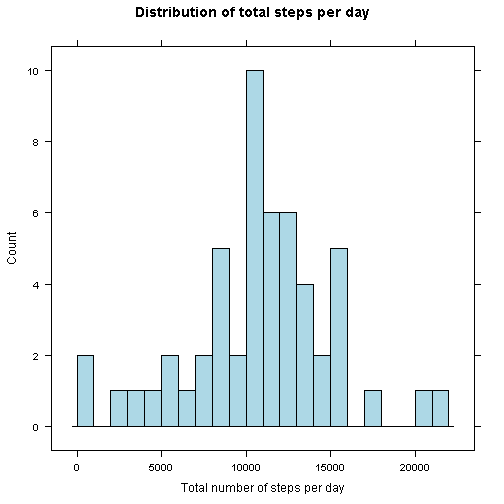
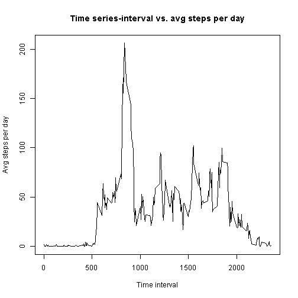
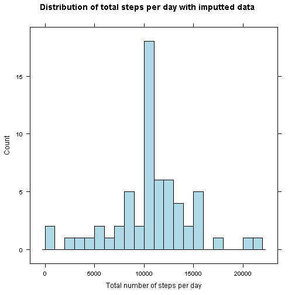
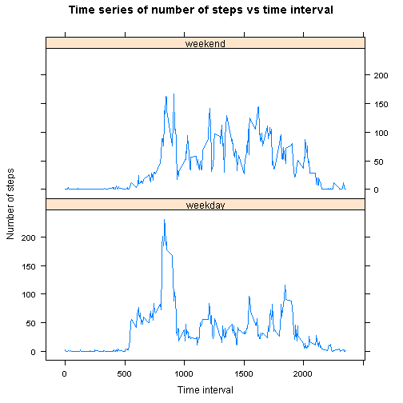

#Introduction
It is now possible to collect a large amount of data about personal movement using activity monitoring devices such as a Fitbit, Nike Fuelband, or Jawbone Up. These type of devices are part of the "quantified self" movement - a group of enthusiasts who take measurements about themselves regularly to improve their health, to find patterns in their behavior, or because they are tech geeks. But these data remain under-utilized both because the raw data are hard to obtain and there is a lack of statistical methods and software for processing and interpreting the data.

This assignment makes use of data from a personal activity monitoring device. This device collects data at 5 minute intervals through out the day. The data consists of two months of data from an anonymous individual collected during the months of October and November, 2012 and include the number of steps taken in 5 minute intervals each day.

#Libraries
The analysis use the following libraries:

```r
library(data.table)
library(lattice)
library(knitr)
library(timeDate)
library(lubridate)
library(dplyr)
```
## Loading and preprocessing the data
Data was downloaded and saved to ./data folder.

```r
if(!file.exists("data")){dir.create("data")}
fileurl<-"https://d396qusza40orc.cloudfront.net/repdata%2Fdata%2Factivity.zip"
destfile="./data/activity.zip"
download.file(fileurl,destfile=destfile)
datedownloaded<-date()
```
Then Unzip and read the data from the activity.zip as data table

```r
data<-data.table(read.csv(unz("./data/activity.zip","activity.csv")))
```
The data looks like this:

```
##    steps       date interval
## 1:    NA 2012-10-01        0
## 2:    NA 2012-10-01        5
## 3:    NA 2012-10-01       10
## 4:    NA 2012-10-01       15
## 5:    NA 2012-10-01       20
## 6:    NA 2012-10-01       25
```
We then Process the data:  
- format $date column to date class  
- remove rows with NA in steps column from the data and saved as newdata  

```r
data$date=ymd(data$date)
newdata<-filter(data,!is.na(steps))
```

## What is mean total number of steps taken per day?
1.Group the processed data by date and summarize the total of steps per date

```r
date_data=group_by(newdata,date)
steps_per_day=summarize(date_data,sum(steps))
setnames(steps_per_day,c("date","total.steps"))
```
The data looks like this:

```
##         date total.steps
## 1 2012-10-02         126
## 2 2012-10-03       11352
## 3 2012-10-04       12116
## 4 2012-10-05       13294
## 5 2012-10-06       15420
## 6 2012-10-07       11015
```
2.Make a histogram of the total number of steps taken each day

```r
histogram(steps_per_day$total.steps, breaks = 20, 
          xlab = "Total number of steps per day", 
          main = "Distribution of total steps per day", 
          col = "lightblue", 
          type = "count")
```

 

3.Calculate and report the mean and median of the total number of steps taken per day

```r
#Mean
mean=round(mean(steps_per_day$total.steps),0)
```

```
## [1] 10766
```

```r
#Median
median=median(steps_per_day$total.steps)
```

```
## [1] 10765
```
## What is the average daily activity pattern?
1. Make a time series plot of the 5-minute interval (x-axis) and the average number of steps taken, averaged across all days (y-axis).
We regroup the data by interval and summarize the mean to plot the data.

```r
#group by interval to calculate the sum
interval_data=group_by(newdata,interval)
steps_per_interval=summarize(interval_data,mean(steps))
setnames(steps_per_interval,c("interval","avg.steps"))
```
The data looks like this:

```
##   interval avg.steps
## 1        0 1.7169811
## 2        5 0.3396226
## 3       10 0.1320755
## 4       15 0.1509434
## 5       20 0.0754717
## 6       25 2.0943396
```
Plot the time series data of interval vs. avg steps per day

```r
plot(steps_per_interval$interval,steps_per_interval$avg.steps,
     type="l",xlab="Time interval",ylab="Avg steps per day",
     main="Time series-interval vs. avg steps per day")
```

 

2.Which 5-minute interval, on average across all the days in the dataset, contains the maximum number of steps?

```r
#interval with max steps per day
steps_per_interval$interval[which.max(steps_per_interval$avg.steps)]
```

```
## [1] 835
```

## Imputing missing values
Note that there are a number of days/intervals where there are missing values (coded as NA). The presence of missing days may introduce bias into some calculations or summaries of the data.  
1.Calculate and report the total number of missing values in the dataset (i.e. the total number of rows with NAs)

```r
#Total number of NAs in steps
sum(is.na(data$steps))
```

```
## [1] 2304
```
2.Devise a strategy for filling in all of the missing values in the dataset. 
Here we use the mean of 5-minute interval. First merge data with step per interval data by interval, then fill the na with same row avg step per interval.
Then we pick the column steps,date and interval and rearrange by date.

```r
#merge data and steps_per_interval by interval
fill=merge(data,steps_per_interval,by="interval")
#fill the na data with the same row avg.steps per interval
fill$steps[is.na(fill$steps)]<-fill$avg.steps[is.na(fill$steps)]
fill=fill[,list(steps,date,interval)]
fill=arrange(fill,date)
```
 the data looks like this:

```
##       steps       date interval
## 1 1.7169811 2012-10-01        0
## 2 0.3396226 2012-10-01        5
## 3 0.1320755 2012-10-01       10
## 4 0.1509434 2012-10-01       15
## 5 0.0754717 2012-10-01       20
## 6 2.0943396 2012-10-01       25
```

4.Make a histogram of the total number of steps taken each day and Calculate and report the mean and median total number of steps taken per day. Do these values differ from the estimates from the first part of the assignment? What is the impact of imputing missing data on the estimates of the total daily number of steps?  
a.Group the imputted data by date and smmurize the total of steps per day.

```r
fill_data=group_by(fill,date)
steps_per_day_fill=summarize(fill_data,sum(steps))
setnames(steps_per_day_fill,c("date","total.steps"))
```
 the data looks like this:

```
##         date total.steps
## 1 2012-10-01    10766.19
## 2 2012-10-02      126.00
## 3 2012-10-03    11352.00
## 4 2012-10-04    12116.00
## 5 2012-10-05    13294.00
## 6 2012-10-06    15420.00
```
b.Make a histogram of the total number of steps taken each day

```r
histogram(steps_per_day_fill$total.steps, breaks = 20, 
          xlab = "Total number of steps per day", 
          main = "Distribution of total steps per day with imputted data", 
          col = "lightblue", 
          type = "count")
```

 

c.Calculate and report the mean and median of the total number of steps taken per day

```r
#Mean
mean_fill=round(mean(steps_per_day_fill$total.steps),0)
```

```
## [1] 10766
```

```r
#Median
median_fill=median(steps_per_day_fill$total.steps)
```

```
## [1] 10765
```

The mean and median are the same as before imputed NA data so imputing missing data doesn't change the estimate of the total daily number of steps.
From the histogram, imputing missing data increase the count of the mean but didn't affect others.It is mainly because most of the NA are missing from the same day and we are basically imputing the mean of total steps per day. 

## Are there differences in activity patterns between weekdays and weekends?
1.Create a new factor variable in the dataset with two levels - "weekday" and "weekend" indicating whether a given date is a weekday or weekend day.

```r
#default dayType to weekend
fill_dayType=fill[,dayType:="weekend"]
#set dayType to weekday for those dates that are weekday
fill_dayType$dayType[which(isWeekday(fill_dayType$date))]="weekday"
```
The data looks like this after arrange by interval:

```
##       steps       date interval dayType
## 1  1.716981 2012-10-01        0 weekday
## 2  0.000000 2012-10-02        0 weekday
## 3  0.000000 2012-10-03        0 weekday
## 4 47.000000 2012-10-04        0 weekday
## 5  0.000000 2012-10-05        0 weekday
## 6  0.000000 2012-10-06        0 weekend
```

2.Make a panel plot containing a time series plot (i.e. type = "l") of the 5-minute interval (x-axis) and the average number of steps taken, averaged across all weekday days or weekend days (y-axis).

Regroup the data by interval and dayType to calculate the average steps

```r
fill_dayType=group_by(fill_dayType,interval,dayType)
steps_per_interval_dayType=summarize(fill_dayType,mean(steps))
setnames(steps_per_interval_dayType,c("interval","dayType","avg.steps"))
```
 the data looks like this:

```
##   interval dayType  avg.steps
## 1        0 weekday 2.25115304
## 2        5 weekday 0.44528302
## 3       10 weekday 0.17316562
## 4       15 weekday 0.19790356
## 5       20 weekday 0.09895178
## 6       25 weekday 1.59035639
```
The time series plot of avg steps vs interval of both weekday and weekend.  

```r
DT=steps_per_interval_dayType
xyplot(DT$avg.steps ~ DT$interval | DT$dayType, layout = c(1, 2), type = "l", 
       xlab = "Time interval",
       ylab = "Number of steps",
       main = "Time series of number of steps vs time interval" )
```

 

From the plot it seems that in the weekdays there are more activity during the morning and less activity during the middle of the day compared to that of weekend.
